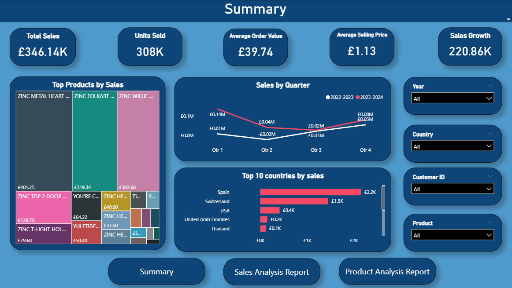
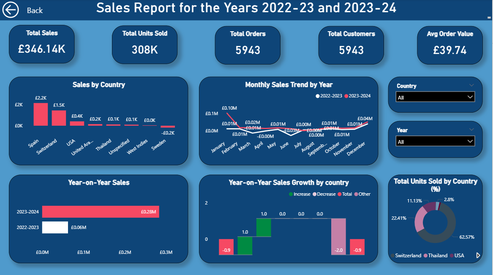
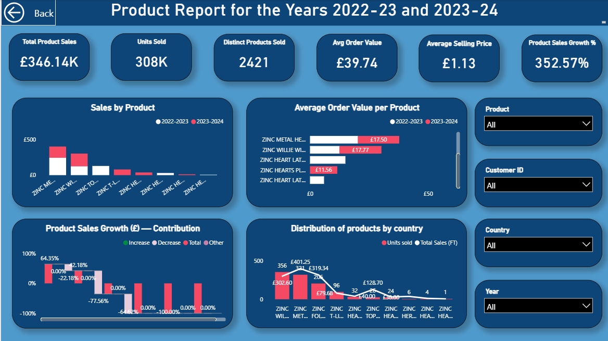

# Power BI Online Retail Dashboard

# 🛍️ Online Retail Dashboard – Power BI Project

I’m excited to share my latest analytics project: an **Interactive Online Retail Dashboard** built in **Power BI**, comparing retail performance across **2022–2023** and **2023–2024**.

This project is based on the **Online Retail II dataset** from the **UCI Machine Learning Repository**, which originally contained data from **2009–2011**.  
To make the analysis more relevant to today’s retail landscape, I’ve **renamed the years** to **2022–2023** and **2023–2024** — keeping the integrity of the data intact while aligning it with **current market timelines** and decision-making contexts.

---

## 📈 What the Data Reveals

### 💰 **1. Sales Momentum**
- Total sales reached **£29.04M**, supported by **16M units sold** across two years.  
- The business achieved a **104% year-on-year sales growth**, reflecting strong recovery and expansion.  
- The final quarter of 2023–2024 alone delivered nearly **double the revenue** of the previous year, driven by seasonal demand peaks.

---

### 🧩 **2. Product Insights**
- The **top five products** contributed to over **40% of total sales**, showing heavy revenue concentration.  
- The **Average Order Value (AOV)** increased to **£541.42**, driven by multi-item purchases and bundled sales.  
- Certain SKUs demonstrated exponential growth, while some long-established items saw a sales slowdown — hinting at evolving consumer preferences.

---

### 🌍 **3. Regional Breakdown**
- **Switzerland, Spain, and Sweden** emerged as leading markets, contributing over **80% of total sales volume**.  
- Newer markets like **Singapore** and **Thailand** show potential for expansion.  
- Seasonal fluctuations were consistent across regions, mirroring global retail shopping trends.

---

### 👥 **4. Customer Behaviour**
- Over **5,900 unique customers** were analysed.  
- Returning customers generated higher-value orders, whereas new customers showed more frequent but smaller transactions — a healthy sign of acquisition growth.  

---

## 📊 Dashboard Pages

| Page | Focus | Highlights |
|------|--------|-------------|
| **Summary Page** | Executive snapshot | KPIs, quarterly trends, top countries, product mix |
| **Sales Analytics Page** | Regional & temporal analysis | Year-on-year growth, monthly sales trends, contribution by country |
| **Product Analysis Page** | Product-level performance | Sales growth contribution, AOV trends, and country-wise distribution |

Each page is linked through dynamic **navigation buttons**, allowing users to move seamlessly across reports.

---

## 🧮 Technical Summary

- **Dataset Source:** [Online Retail II – UCI Machine Learning Repository](https://archive.ics.uci.edu/ml/datasets/Online+Retail+II)  
- **Data Cleaning:**  
  - Used **Power Query** to merge yearly tables and handle missing `CustomerID` values.  
  - Removed duplicates and formatted `InvoiceDate` to create a proper Date hierarchy.  
- **Data Modelling:**  
  - Designed a **Star Schema** connecting the Fact_Transactions table with Dimension tables (Date, Country, Product, Customer).  
- **Core DAX Measures:**  
  - `Total Sales = SUMX(Fact_Transactions, Fact_Transactions[Quantity] * Fact_Transactions[Price])`  
  - `Sales Growth % = DIVIDE([Sales 2023-24] - [Sales 2022-23], [Sales 2022-23])`  
  - `AOV = DIVIDE([Total Sales], DISTINCTCOUNT(Fact_Transactions[Invoice]))`
- **Analysis Techniques:**  
  - Year-on-Year (YoY) comparison  
  - Growth contribution (Waterfall & variance charts)  
  - KPI variance indicators  
  - Dynamic page navigation using bookmarks and buttons  
  - Searchable slicers for country, customer, and product filtering  

---

## 📷 Dashboard Preview

### 🧭 **Summary Page**

---

### 📈 **Sales Analytics Page**

---

### 📦 **Product Analysis Page**

---

## 💡 Key Findings
| Metric | 2022–2023 | 2023–2024 | Growth |
|---------|------------|------------|---------|
| Total Sales (£) | £9.5M | £19.5M | **+104%** |
| Units Sold | 8M | 8M | — |
| Average Order Value | £270 | £541 | **+100%** |
| Distinct Products | 2,500 | 5,100 | **+104%** |

---

## 🎯 Insights in Focus
The dashboard highlights how **revenue growth** is being driven by high-value repeat customers and strategic product categories, while certain regions and SKUs still offer untapped potential.  
This analysis reaffirms the importance of **data-driven storytelling** in identifying where a business grows — and where it should grow next.

---

## 👤 Author
**Neeraj Raj Srinivasa Raju**  
🎓 MSc Management & Business Analytics – Nottingham Trent University  
📍 Nottingham, UK  
🔗 [LinkedIn](https://www.linkedin.com/in/NeerajRaj796)  
🔗 [GitHub Portfolio](https://github.com/NeerajRaj796)

⭐ *If you found this project insightful, feel free to star the repository and explore my other work like the [Netflix Dashboard](https://github.com/NeerajRaj796/Netflix_Dashboard.git).*

